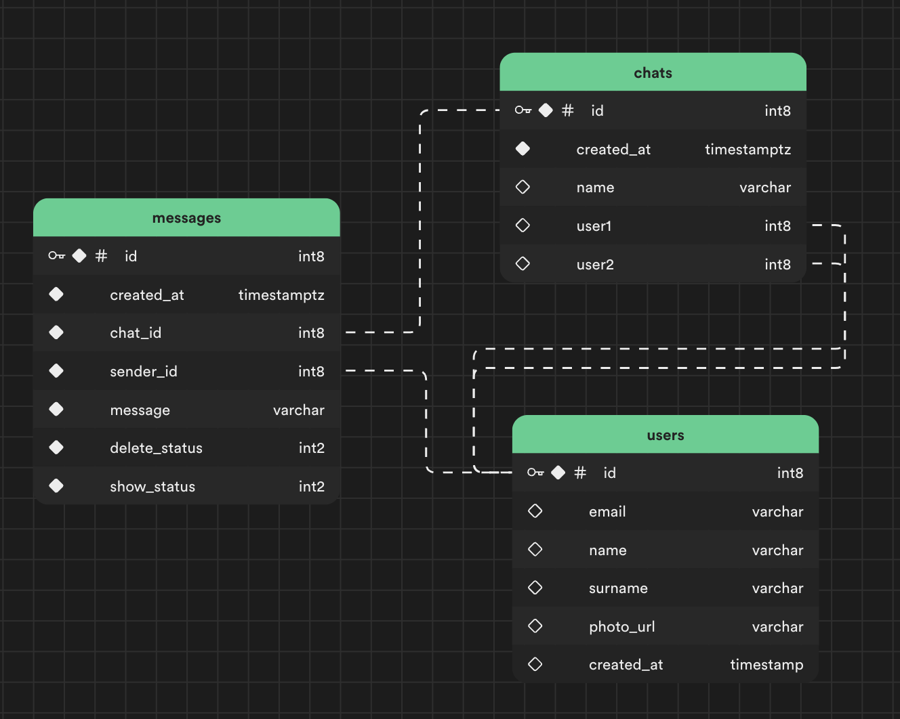

# Riverpod Clean Architecture Chat App

This is a chat application built using the Riverpod state management library and follows the clean architecture.

## Folder Structure

The project uses a feature-based folder structure to organize code:

## Dependencies

- Riverpod (hooks_riverpod)
- Supabase
- Freezed

## Database Scheme Visualizer:

## Getting Started

1. Clone this repository.
2. Run `flutter pub get` to install dependencies.
3. Configure Supabase initialize `.
4. Run the app using `flutter run`.

## Unit Tests

Unit tests have been written for Riverpod and Supabase functionality. You can run the tests using the following command:

